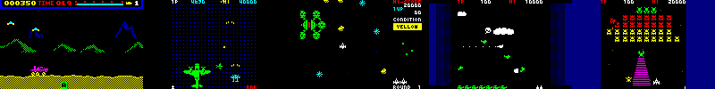

# n80dev
 Game Development Library for PC-8001



これら PC-8001/mkII 用のゲーム開発に使ったライブラリです。

## 開発環境

コンパイラには SDCC 4.0.0 を使っています。

## ライブラリの構成

+ n80dev.h

ゲーム側のソースコードで include するファイルです。

n80dev.h 内で n80dev_config.h を include しますが、
n80dev_config.h はゲーム側のフォルダに用意して、
ファイル内で各種 define を定義します。

n80dev_config.h の例
```
#ifndef _N80DEV_CONFIG_H
#define _N80DEV_CONFIG_H

#define ENABLE_ASSERT

#define PUSH_KEYS (KEY_X | KEY_Z | KEY_SPACE | KEY_RET)

#define LIST_HEADER_DUMMY_SIZE 8

#define COUNT_VRTC_IN_LIB

#endif
```


### PC-8001mkII 描画

PC-8001mkII のグラフィック描画用の関数

+ 80mk2.c
+ 80mk2.h
+ 80mk2_kanji.c

### BCD 関連

主にスコアの計算に使用

スコアの下一桁を 0 固定で 100 万点を表現するのに BCD 3 バイトが必要
(XX YY ZZ ⇒ ZZ YY XX 0)

+ bcd_add16.c
+ bcd_add8.c
+ bcd_to_ascii.c
+ ~~bcd_utils.c~~ ← 後方互換のため
+ bcd_utils.h
+ bcd24_compare.c

### BEEP/BGM 関連

+ beep.c
+ beep.h
+ bgm.c
+ bgm.h

### ビットマップ描画

+ bitmap.c
+ bitmap.h
+ bitmap_hires.c
+ make_rot.c

### 当たり判定

+ collision.c
+ collision.h
+ collision0.c
+ collision0_cy.c
+ collision2.c
+ collision2_cy.c
+ collision4.c
+ collision4_cy.c

### CRTC/デュアルバッファ

+ count_vrtc.c
+ crtc.c
+ screen.c
+ screen.h

### 方向テーブル

+ dirtbl.c
+ dirtbl.h
+ get_dir.c
+ get_dir.h

### その他、ユーティリティ

+ hex2asc.c
+ timer.c
+ timer.h

### セミグラフィック描画

+ draw_bytes.c
+ draw_char.c
+ draw_hlines.c
+ draw_patlines.c
+ draw_pixel.c
+ draw_pixel.h
+ draw_rect.c
+ draw_wchar.c
+ fill_bytes.c
+ line.c
+ line.h
+ make_bmp.c

### ZX0 圧縮のデコード

+ dzx0_fast.asm
+ dzx0_mega.asm
+ dzx0_standard.asm
+ dzx0_turbo.asm

### フォント描画

+ font.c
+ font.h
+ font_put_bcd.c
+ font3x4.png
+ font3x4_pat.h
+ font4x6.png
+ font4x6_pat.h
+ font5x5_pat.h
+ sfont.c
+ sfont_msglist.c

### アトリビュート操作

+ insert_attr.c
+ insert_attr.h
+ insert_attr3.c
+ insert_attr3_new.c
+ render_attr.c
+ render_attr_new.c

### キー入力

+ keyfunc.c
+ keyfunc.h
+ keyin.c
+ keyin.h
+ wait_key.c

### リスト構造

+ list.c
+ list.h

### CMT ローダー

+ loader.c
+ loader.h

### 外付け MP3 プレイヤー

+ mp3play.c
+ mp3play.h

### CRT ファイル

+ mycrt0.asm
+ mycrt0_ram0.asm
+ nocrt0.asm

### ネームエントリー

+ nentry.c
+ nentry.h
+ nentry_sd.c
+ ranking.c
+ ranking.h

### PCG 定義

+ pcg.c
+ pcg.h

### 乱数

+ rand.c
+ rand.h

### 回転行列

+ rotate.c
+ rotate.h

### SD カード

+ sdex.c
+ sdex.h
